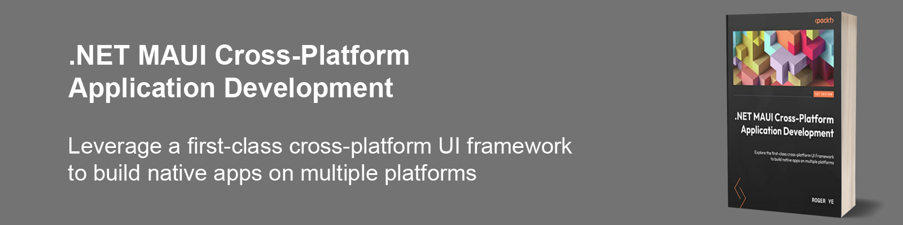
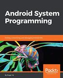
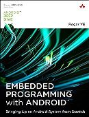

### Hi there, I'm Roger Ye 👋

 

This is my GitHub repositories for books and apps.

| Buy @ Amazon  | Title |
| ------------- | ------------- |
||**.NET MAUI Cross-Platform Application Development** (2nd edition)   [PassXYZ.Vault2](https://github.com/shugaoye/PassXYZ.Vault2) - A password manager app built with .NET MAUI   [KPCLib](https://github.com/shugaoye/KPCLib) - .NET Standard 2.0 build of KeePassLib   [PassXYZLib](https://github.com/shugaoye/PassXYZLib) - .NET MAUI class library to extend KPCLib |
|   | **.NET MAUI Cross-Platform Application Development**   [PassXYZ.Vault2](https://github.com/shugaoye/PassXYZ.Vault2) - A password manager app built with .NET MAUI   [KPCLib](https://github.com/shugaoye/KPCLib) - .NET Standard 2.0 build of KeePassLib   [PassXYZLib](https://github.com/shugaoye/PassXYZLib) - .NET MAUI class library to extend KPCLib  |
|   | **Android System Programming**   The source of this book needs to be updated according to [android-x86](https://www.android-x86.org/source.html) |
|  | **Embedded Programming with Android**   [armemu](https://github.com/shugaoye/armemu) - A virtual device configuration for AOSP build   [goldfish](https://github.com/shugaoye/goldfish) - Android emulator kernel |

<!--
**shugaoye/shugaoye** is a ✨ _special_ ✨ repository because its `README.md` (this file) appears on your GitHub profile.

Here are some ideas to get you started:

- 🔭 I’m currently working on ...
- 🌱 I’m currently learning ...
- 👯 I’m looking to collaborate on ...
- 🤔 I’m looking for help with ...
- 💬 Ask me about ...
- 📫 How to reach me: ...
- 😄 Pronouns: ...
- ⚡ Fun fact: ...
  -->
